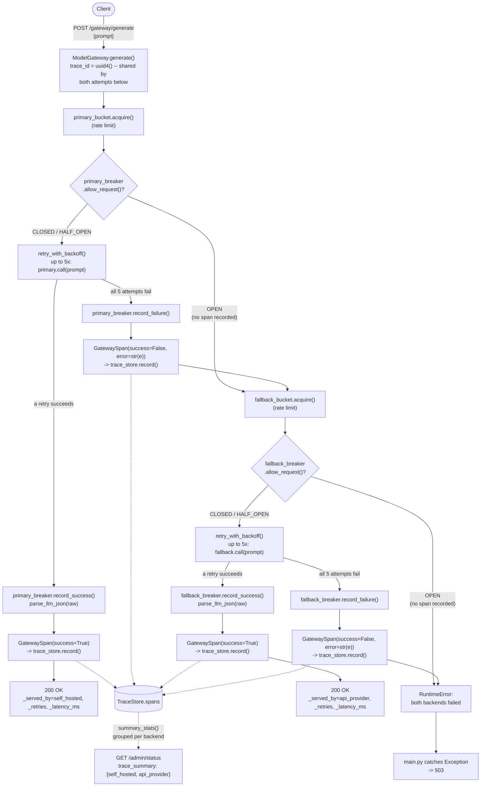

# Architecture

## Request flow



If your renderer doesn't do Mermaid, the same flow in text:

```
client
  |
  |  POST /gateway/generate {prompt}
  v
ModelGateway.generate()
  trace_id = uuid4()            <- one id, shared by the primary AND fallback
  t0 = perf_counter()              attempt below, so both can be correlated
  |
  |============ ATTEMPT 1: primary (self_hosted) ============
  v
  primary_bucket.acquire()               [rate limiter]
  v
  primary_breaker.allow_request()?       [circuit breaker]
    -- OPEN -----------------------------------> skip straight to fallback
    |                                            (no GatewaySpan recorded --
    -- CLOSED / HALF_OPEN                         see "known gap" below)
    v
  retry_with_backoff(primary.call, max_attempts=5)   [retry]
    -- success -----> primary_breaker.record_success()
    |                 parse_llm_json(raw)
    |                 GatewaySpan(success=True, retries, latency_ms,
    |                             circuit_state, cost_usd) -> trace_store.record()
    |                 return 200 {_served_by: self_hosted, _retries, _latency_ms, ...}
    |
    -- exhausted --> primary_breaker.record_failure()
                       GatewaySpan(success=False, error=str(e), ...) -> trace_store.record()
                       fall through (do NOT re-raise) --v
  |
  |============ ATTEMPT 2: fallback (api_provider) ===========
  v
  fallback_bucket.acquire()              [rate limiter]
  v
  fallback_breaker.allow_request()?      [circuit breaker]
    -- OPEN -----------------------------------> nowhere left to fall back to
    |                                            (no GatewaySpan recorded)
    -- CLOSED / HALF_OPEN
    v
  retry_with_backoff(fallback.call, max_attempts=5)  [retry]
    -- success -----> fallback_breaker.record_success()
    |                 parse_llm_json(raw)
    |                 GatewaySpan(success=True, ...) -> trace_store.record()
    |                 return 200 {_served_by: api_provider, _retries, _latency_ms, ...}
    |
    -- exhausted --> fallback_breaker.record_failure()
                       GatewaySpan(success=False, ...) -> trace_store.record()
                       raise RuntimeError("both backends failed: ...")
                       v
                       main.py's `except Exception` -> HTTPException(503)

Meanwhile, independently at any time:
  GET /admin/status -> merges {self_hosted_degraded, api_provider_degraded}
                        with trace_store.summary_stats(), which groups every
                        recorded GatewaySpan by backend and returns per-backend
                        success_rate, p50/p95 latency, circuit_state (last
                        recorded span's state -- a snapshot, not live), and
                        total_cost_usd.
```

## Key design points

- **Per-backend isolation, not shared:** `primary_bucket`/`fallback_bucket` and
  `primary_breaker`/`fallback_breaker` are two completely independent pairs.
  If they were shared/global, a tripped primary breaker would also block the
  "healthy" fallback, defeating the entire point of having one.
- **`circuit_state` is captured at request time, not read fresh later:** each
  `GatewaySpan` records the breaker's state *before* that attempt ran, not
  after. That's what makes "this specific request is the one that tripped the
  breaker" reconstructable after the fact — read it live instead and you'd
  never see the moment of the trip, only its aftermath.
- **Known gap — circuit-open skips are invisible to tracing:** when
  `allow_request()` returns `False`, `_attempt_backend` raises immediately,
  before any `GatewaySpan` is built. So `TraceStore`'s `request_count` for a
  backend only reflects attempts that were actually tried, not every request
  that was *routed toward* it — once a breaker opens, further requests to
  that backend leave no trace at all, and `/admin/status`'s `circuit_state`
  for it goes stale (frozen at whatever the last real attempt recorded)
  until a HALF_OPEN probe eventually runs and gets recorded.
- **Retries can mask failures from the breaker — but only per request,
  not under real concurrency:** `failure_threshold` counts failures at the
  `_attempt_backend` level (after all 5 raw retries are exhausted), so any
  *one* request against a 95%-degraded backend has only a ~78% chance of
  exhausting all 5 retries. Sequentially, that argues the breaker could
  stay CLOSED indefinitely. It doesn't hold up under load: at concurrency
  10, multiple requests fail out close enough together that the breaker
  trips reliably (verified: 10/10 load-test runs tripped it, 1-5 times
  per run). The "retries mask failures" effect is real, it just isn't the
  whole story once more than one request is in flight at a time.
- **The breaker wasn't safe under concurrent access (fixed):**
  `allow_request()` let *every* concurrent caller through once state was
  HALF_OPEN, not just one probe, and `record_success()`/`record_failure()`
  unconditionally overwrote `state` with no check on whether it was still
  the state the caller had originally observed. Verified directly: in
  most load-test runs, `record_success` transitioned the breaker straight
  `OPEN -> CLOSED`, bypassing HALF_OPEN — a request admitted while CLOSED,
  finishing late (after its own retries) after a *different* concurrent
  request had already tripped the breaker, clobbering the legitimate
  reopen. Fixed in `app/resilience.py` lines 94-127:
  `record_success`/`record_failure` now no-op when the breaker is already
  OPEN, and `allow_request` admits exactly one caller as the HALF_OPEN
  probe, rejecting the rest until it resolves. Reran the load test 5x
  post-fix: zero bypasses, every cycle goes cooldown -> single probe ->
  resolve cleanly.
